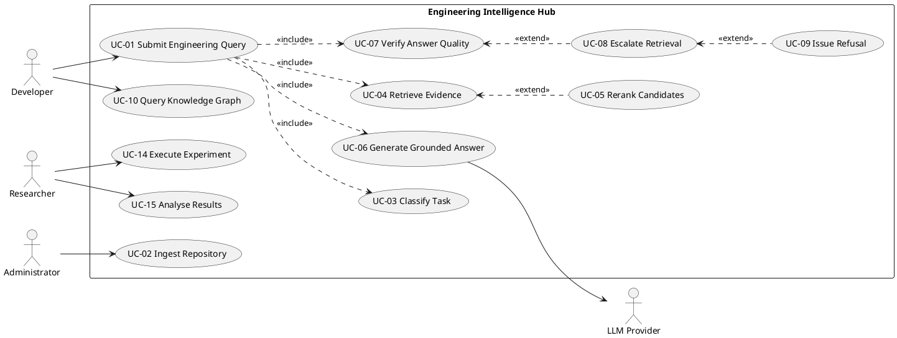

# Software Requirements Specification

## For

# Engineering Intelligence Hub (EIH)
### A Task-Aware, Quality-Constrained Retrieval-Augmented Generation System for Software Engineering

**Date:** _____________

---

**Prepared by**

| Specialization | SAP ID | Name |
|---|---|---|
| Computer Science (AI/ML) | | |
| Computer Science (AI/ML) | | |
| Computer Science (AI/ML) | | |

---

**School Of Computer Science**
**UNIVERSITY OF PETROLEUM & ENERGY STUDIES,**
**DEHRADUN- 248007. Uttarakhand**

---

> **Formatting note for the final document:** Body text Times New Roman 12,
> justified, line spacing 1.15. Main headings Times New Roman 14, all capitals.
> Sub-headings Times New Roman 12, underlined. Table contents Times New Roman 10.
> Captions for tables and figures Times New Roman 11. All figures require a source
> attribution; figures marked *(Source: Authors)* below are original to this project.

---

## Table of Contents

| Topic | Page No |
|---|---|
| Table of Contents | |
| Revision History | |
| **1 Introduction** | |
| 1.1 Purpose of the Project | |
| 1.2 Target Beneficiary | |
| 1.3 Project Scope | |
| 1.4 References | |
| **2 Project Description** | |
| 2.1 Reference Algorithm | |
| 2.2 Characteristic of Data | |
| 2.3 SWOT Analysis | |
| 2.4 Project Features | |
| 2.5 User Classes and Characteristics | |
| 2.6 Design and Implementation Constraints | |
| 2.7 Design Diagrams | |
| 2.8 Assumptions and Dependencies | |
| **3 System Requirements** | |
| 3.1 User Interface | |
| 3.2 Software Interface | |
| 3.3 Database Interface | |
| 3.4 Protocols | |
| **4 Non-functional Requirements** | |
| 4.1 Performance Requirements | |
| 4.2 Security Requirements | |
| 4.3 Software Quality Attributes | |
| **5 Other Requirements** | |
| Appendix A: Glossary | |
| Appendix B: Analysis Model | |
| Appendix C: Issues List | |

---

## Revision History

| Date | Change | Reason for Changes | Mentor Signature |
|---|---|---|---|
| | Initial SRS release | Baseline specification for Major Project | |
| | | | |
| | | | |

---

# 1. INTRODUCTION

## 1.1 Purpose of the Project

### Problem Statement

Software developers spend a substantial proportion of their working time locating
and comprehending existing engineering knowledge — source code, documentation,
architectural decisions, historical defects and change history — rather than
authoring new functionality. Large Language Model (LLM) based assistants are
increasingly deployed to address this, but the prevailing pattern submits very
large volumes of context to a large model on every query.

This produces three distinct deficiencies:

**(a) Uniform cost for non-uniform tasks.** A trivial configuration lookup and a
complex cross-module change-impact analysis consume comparable computational
resources under a fixed-context approach, although they differ in intrinsic
difficulty by orders of magnitude.

**(b) Unverified output.** Generated answers are returned irrespective of whether
the retrieved evidence actually supports them. Fabricated or unsupported claims are
difficult to detect and are not systematically penalised.

**(c) Unmeasured environmental cost.** The energy and carbon consequences of
repeated large-context inference are rarely quantified, and where quantified are
typically estimated from token counts rather than measured from hardware.

### Motivation

A naive corrective assumption — that Retrieval-Augmented Generation (RAG) is
inherently more efficient because it retrieves less text — is not defensible. A RAG
pipeline introduces its own computational costs: query embedding, dense vector
search, sparse keyword search, score fusion, cross-encoder reranking, optional graph
traversal, and possible regeneration when verification fails. A poorly configured
RAG system can consume more resources than a single large-context call.

Published evidence establishes that this design space is both large and opaque.
Configurations achieving accuracy within three percent of one another have been
reported to differ by up to **20.2 times in energy consumption** [1]. Independently,
a controlled experiment on RAG energy-reduction techniques reported energy savings
of up to **60 percent** for some techniques while others degraded accuracy by up to
**30 percent** [2].

The second finding is the direct motivation for this project. It demonstrates that
energy optimisation applied *without an enforced quality constraint* silently
degrades correctness. This project therefore treats answer quality as a **hard
constraint that the system is architecturally prohibited from violating**, rather
than as one term in a weighted objective function.

### Purpose

The purpose of this project is to specify, design and implement the **Engineering
Intelligence Hub (EIH)** — a task-aware engineering assistant which:

1. Classifies each incoming engineering task by Software Development Life Cycle
   (SDLC) stage, task type, complexity, criticality and security sensitivity.
2. Allocates retrieval depth, structural context, reranking effort and model
   capacity in proportion to that classification.
3. Grounds every generated answer in retrieved repository evidence with verifiable
   inline citations.
4. Verifies each answer against a task-specific quality threshold, escalates
   through progressively stronger retrieval on failure, and refuses explicitly when
   sufficient evidence cannot be established.
5. Measures latency, token consumption, monetary cost, energy and carbon-dioxide
   equivalent emissions for every operation, and reports the resulting
   quality–resource trade-off as a Pareto frontier.

### Research Question

> Under what conditions does task-aware, quality-constrained Retrieval-Augmented
> Generation reduce developer effort, latency, computational cost, energy
> consumption and CO₂e emissions for software engineering tasks, while maintaining
> or improving engineering answer quality, reliability and security?

---

## 1.2 Target Beneficiary

| Beneficiary | Benefit derived |
|---|---|
| **Software developers** | Reduced time locating and comprehending unfamiliar code; grounded, citation-backed answers that can be independently verified rather than trusted blindly |
| **New team members / onboarding engineers** | Accelerated repository comprehension without requiring senior engineer availability |
| **Technical leads and architects** | Dependency analysis, change-impact assessment and architectural decision retrieval supported by structural knowledge-graph reasoning |
| **Quality assurance and code reviewers** | Automated defect and risk identification with traceable evidence for every finding |
| **Site reliability and operations engineers** | Incident diagnosis linking symptoms to historical incidents, causative commits and affected modules |
| **Engineering organisations** | Reduced duplicated engineering effort through systematic knowledge reuse; quantified computational and carbon cost of AI-assisted development |
| **Sustainability and Green-AI research community** | An empirically measured quality-versus-energy Pareto frontier for software engineering RAG, with a reproducible and contamination-aware evaluation methodology |
| **Academic research community** | A provenance-preserving benchmark and evaluation protocol reusable by subsequent studies |

---

## 1.3 Project Scope

### Area of Application

The system operates across the complete Software Development Life Cycle rather than
being confined to code generation. Supported engineering activities span
requirements comprehension, architectural reasoning, development assistance, test
generation and failure diagnosis, code review, deployment change-impact analysis,
operational incident diagnosis, and maintenance.

### Objectives

| ID | Objective |
|---|---|
| **O1** | Design and implement a multi-modal engineering knowledge index combining dense vector retrieval, sparse keyword retrieval and a structural knowledge graph |
| **O2** | Implement automatic engineering task classification producing SDLC stage, task type, complexity, criticality and a per-task quality threshold |
| **O3** | Implement adaptive retrieval that selects strategy and depth from the task classification |
| **O4** | Implement grounded generation producing inline, verifiable citations to repository evidence |
| **O5** | Implement a multi-signal quality verification gate with bounded escalation and explicit refusal |
| **O6** | Instrument the complete pipeline for latency, tokens, cost, directly measured energy and region-aware CO₂e |
| **O7** | Construct a provenance-preserving software engineering benchmark carrying retrieval ground truth in addition to answer ground truth |
| **O8** | Construct a contamination-controlled held-out evaluation set collected after model training cut-off dates |
| **O9** | Conduct a controlled five-system ablation study and derive the quality–energy–cost–latency Pareto frontier |

### Deliverables

| ID | Deliverable |
|---|---|
| **D1** | Complete EIH software system with REST Application Programming Interface |
| **D2** | Ingested multi-repository, multi-language engineering knowledge corpus |
| **D3** | EIH-SWE benchmark (approximately 400 human-verified tasks spanning the SDLC) |
| **D4** | EIH-Fresh contamination-controlled held-out test set |
| **D5** | Controlled evaluation framework with frozen experiment manifest and deterministic splits |
| **D6** | Experimental results: ablation deltas, Pareto frontier, failure taxonomy analysis |
| **D7** | Research paper suitable for submission to a peer-reviewed software engineering venue |
| **D8** | Reproducibility package: hardware specification, software versions, random seeds, configuration and pinned repository commits |

### Out of Scope

The following are explicitly excluded from the present specification: automated
deployment of generated code to production environments; real-time collaborative
multi-user editing; integration with proprietary or closed-source corporate
repositories; and any claim of empirically validated business-level outcomes such as
return on investment, which would require longitudinal production deployment.

---

## 1.4 References

| # | Reference |
|---|---|
| [1] | M. Z. Pan et al., "Towards Automatically Optimizing Retrieval Augmented AI Systems." OpenReview. Reports up to 20.2× energy variation among RAG configurations within ≤3% accuracy. |
| [2] | "On the Effectiveness of Proposed Techniques to Reduce Energy Consumption in RAG Systems: A Controlled Experiment," *Proc. IEEE/ACM 48th International Conference on Software Engineering (ICSE)*, 2026. arXiv:2601.02522. DOI: 10.1145/3786581.3786932 |
| [3] | "CodeRepoQA: A Large-scale Benchmark for Software Engineering Question Answering," arXiv:2412.14764; published in *Proc. 48th ACM SIGIR Conference*, 2025. DOI: 10.1145/3726302.3730262 |
| [4] | "Beyond Code Snippets: Benchmarking LLMs on Repository-Level Question Answering" (StackRepoQA), arXiv:2603.26567 |
| [5] | OpenAI, "Why we no longer evaluate SWE-bench Verified," February 2026. https://openai.com/index/why-we-no-longer-evaluate-swe-bench-verified/ |
| [6] | "SWE-Bench Pro: Can AI Agents Solve Long-Horizon Software Engineering Tasks?" arXiv:2509.16941 |
| [7] | "SWE-rebench: An Automated Pipeline for Task Collection and Decontaminated Evaluation of Software Engineering Agents," *NeurIPS* 2025. arXiv:2505.20411 |
| [8] | D. Zan et al., "Multi-SWE-bench: A Multilingual Benchmark for Issue Resolving," *NeurIPS 2025 Datasets and Benchmarks Track*. arXiv:2504.02605 |
| [9] | "A Survey of Energy Concerns for Software Engineering," *Journal of Systems and Software*, 2024 |
| [10] | "Sustainability in the Field of Software Engineering: A Tertiary Study," *ACM Transactions on Software Engineering and Methodology*, 2026 |
| [11] | "Green Artificial Intelligence: A Comprehensive Review of Metrics, Tools, Challenges, Trends, and Future Prospects," *Archives of Computational Methods in Engineering*, 2026 |
| [12] | "Efficient and Green Large Language Models for Software Engineering: Literature Review, Vision, and the Road Ahead" |
| [13] | "AutoRAG: Automated Framework for optimization of Retrieval Augmented Generation Pipeline," arXiv:2410.20878 |
| [14] | "The ML.ENERGY Benchmark: Toward Automated Inference Energy Measurement and Optimization," arXiv:2505.06371 |
| [15] | Qdrant Vector Database Documentation. https://qdrant.tech/documentation/ |
| [16] | Neo4j Graph Database Documentation. https://neo4j.com/docs/ |
| [17] | National Grid ESO Carbon Intensity API. https://carbonintensity.org.uk |
| [18] | Patterson et al., "Carbon Emissions and Large Neural Network Training," arXiv:2104.10350 |
| [19] | Lannelongue et al., "Green Algorithms: Quantifying the Carbon Footprint of Computation," *Advanced Science*, 2021. DOI: 10.1002/advs.202100707 |

*Note: references [9]–[12] require independent bibliographic verification prior to final submission.*

---

# 2. PROJECT DESCRIPTION

## 2.1 Reference Algorithm

### 2.1.1 Core Algorithm — Task-Aware Quality-Constrained Retrieval and Generation

The system's central algorithm accepts an engineering query and returns a grounded,
cited answer, or an explicit refusal. The distinguishing property is that the
resource-allocation decision is derived from an automatically inferred task
classification, and that the quality threshold acts as a termination condition
rather than an objective term.

```
ALGORITHM: AdaptiveQualityConstrainedRAG

INPUT:  q         — engineering query (natural language)
        R         — repository scope (optional)
OUTPUT: A         — grounded answer with citations, or explicit refusal
        T         — telemetry record (latency, tokens, energy, cost, CO2e)

BEGIN
  1.  C  <- Classify(q)
        C = {sdlc_stage, task_type, complexity, criticality,
             security_sensitivity, quality_threshold θ}

  2.  S  <- ResolveStrategy(C)
        IF C.criticality ∈ {HIGH, CRITICAL} THEN
            S <- EscalatedStrategy(C.task_type)
        ELSE
            S <- PolicyMap(C.task_type)

  3.  M  <- RouteModel(C.complexity, C.criticality)

  4.  attempt <- 0
      Emax    <- max_escalation_attempts

  5.  WHILE attempt <= Emax DO

  5.1     D <- DenseRetrieve(q, S.top_k, S.filters)
          B <- SparseRetrieve(q, S.top_k, S.filters)
          F <- WeightedFusion(D, B, S.dense_weight, S.sparse_weight)

  5.2     IF S.include_graph_context THEN
              G <- GraphExpand(F, S.graph_hop_depth)
              F <- F ⊕ G
          END IF

  5.3     IF S.enable_reranking THEN
              F <- CrossEncoderRerank(q, F, S.reranker_top_n)
              T.energy <- T.energy + MeasureGPUEnergy()
          END IF

  5.4     P <- BuildGroundedPrompt(q, F)
          A <- Generate(M, P)
          T <- T ⊕ RecordTelemetry(latency, tokens, energy, cost, CO2e)

  5.5     Q <- Verify(q, A, F)
              Q = w1·Citation + w2·Relevance + w3·Coverage + w4·Consistency

  5.6     IF Q >= θ THEN
              RETURN (A, T)                        // quality constraint satisfied
          ELSE IF attempt < Emax THEN
              S <- Escalate(S, attempt)            // stronger retrieval
              attempt <- attempt + 1
          ELSE
              RETURN (INSUFFICIENT_EVIDENCE, T)    // explicit refusal
          END IF

      END WHILE
END
```

### 2.1.2 Escalation Ladder

Escalation is deterministic and strictly bounded. Each rung increases retrieval
capability and therefore resource consumption.

| Attempt | Action | Rationale |
|---|---|---|
| 0 | Policy-selected strategy | Least-cost configuration appropriate to the task |
| 1 | Widen `top_k`; increase context window; lower score threshold | Evidence may exist beyond the initial retrieval depth |
| 2 | Activate graph neighbourhood expansion | Required evidence may be structurally rather than lexically related |
| 3 | Maximal capability: graph expansion with cross-encoder reranking over a widened candidate pool | Final attempt; maximum precision recovery |
| Exhausted | Return explicit `INSUFFICIENT EVIDENCE` refusal | Quality constraint may not be violated |

### 2.1.3 Optimisation Formulation

The system solves a constrained minimisation rather than a weighted-sum
maximisation. A weighted sum would require arbitrary weights and would permit
quality to be traded away.

```
    minimise    α·Latency + β·Cost + γ·Energy + δ·CO₂e + ε·Rework

    subject to  Quality       >=  θ(task)
                Reliability   >=  R_min      (where measurable)
                SecurityRisk  <=  S_max      (where measurable)
                Latency       <=  L_max
```

### 2.1.4 Supporting Algorithms

| Algorithm | Purpose | Method |
|---|---|---|
| AST symbol-boundary chunking | Preserve semantic units | Abstract syntax tree traversal; chunk boundaries at function, class and method definitions |
| Code-aware tokenisation | Identifier matching | Splits camelCase, snake_case, dotted notation and path separators before indexing |
| Weighted score fusion | Combine dense and sparse rankings | `score = w_d · score_dense + w_s · score_sparse` over the union of candidate sets |
| Cross-encoder reranking | Precision recovery | Joint (query, chunk) forward pass modelling term interaction, unavailable to independent bi-encoder embedding |
| Bounded graph expansion | Structural context | Breadth-limited neighbourhood traversal to configured hop depth |
| Stratified deterministic partitioning | Reproducible splits | Fixed-seed stratified sampling balanced across SDLC stage and repository |

### 2.1.5 Principal Data Structures

| Structure | Type | Purpose |
|---|---|---|
| `EngTaskRequest` | Record | Incoming query with optional scope and hints |
| `TaskClassification` | Record | Classifier output; drives all downstream allocation |
| `KnowledgeChunk` | Record | Indexed unit: content, embedding vector, provenance, line range, metadata |
| `RetrievedChunk` | Record | Chunk with relevance score and ranking provenance |
| `RetrievalResult` | Record | Ranked chunk list with strategy and latency metadata |
| `RetrievalStrategyConfig` | Record | Complete retrieval configuration for one execution |
| `QualitySignal` / `QualityReport` | Record | Individual and aggregated verification outcomes |
| `EngTaskResponse` | Record | Answer with quality, retrieval and sustainability telemetry |
| Dense index | HNSW graph | Approximate nearest-neighbour vector search |
| Sparse index | Inverted index | BM25Plus term-frequency ranking |
| Knowledge graph | Labelled property graph | Entities and typed relationships with line-level provenance |
| Experiment manifest | Hashed record | Frozen experimental parameters bound by SHA-256 digest |

---

## 2.2 Characteristic of Data

### 2.2.1 Data Sources

**Primary data source (collected by the project).** Open-source software
repositories obtained directly from public version control, at pinned release tags
with commit hashes resolved from the actual clone. Each repository contributes
source code, documentation, configuration, test suites and version-control history.

**Secondary data sources (established published benchmarks).** External evaluation
datasets used for independent validation, listed in §2.2.4.

### 2.2.2 Corpus Composition

The knowledge corpus is drawn from repositories selected across eight programming
languages. Repository selection follows a strict principle:

> **Repository selection is determined by benchmark coverage, not by preference.**
> Each external benchmark poses questions concerning specific repositories. Where a
> repository is absent from the corpus, retrieval cannot return relevant evidence,
> all retrieval-enabled system configurations degrade to the no-retrieval baseline,
> and the comparison becomes uninformative. The corpus is therefore the union of the
> repositories referenced by the selected benchmarks together with those used for
> the project's own benchmark.

| Artefact category | Content |
|---|---|
| Source code | Modules, classes, functions, methods |
| Tests | Unit tests, integration tests, fixtures |
| Documentation | READMEs, API documentation, tutorials, architecture decision records |
| Configuration | YAML, JSON, TOML, build and dependency manifests |
| Engineering history | Commits, pull requests, issues, code review discussions, releases |
| Operational data | Incident reports, error and log patterns |

Each repository entry in the registry records: owner, name, canonical URL, primary
language, licence, application domain, pinned tag, resolved commit hash, benchmark
alignment, SDLC coverage and a written selection rationale.

### 2.2.3 Benchmark Data Schema

Each benchmark task carries retrieval ground truth in addition to answer ground
truth. This is the property that permits retrieval quality and generation quality to
be scored **independently**, which answer-string comparison alone cannot achieve.

| Field | Purpose |
|---|---|
| `task_id`, `schema_version` | Identity and versioning |
| `query` | The engineering question posed |
| `sdlc_stage`, `task_type` | Taxonomic classification |
| `complexity`, `criticality`, `security_sensitivity` | Difficulty and risk characterisation |
| `repository`, `language`, `base_commit` | Corpus binding |
| `relevant_files`, `relevant_symbols` | **Retrieval ground truth** |
| `required_evidence` | File, line span and justification for each required item |
| `graph_paths` | Expected structural traversal paths |
| `ground_truth_answer`, `acceptable_alternatives` | Generation ground truth |
| `expected_citations` | Citation ground truth |
| `expected_quality_threshold` | Per-task acceptance threshold |
| `evaluation_type` | retrieval \| generation \| retrieval+generation \| patch |
| `provenance` | Issue, pull request, collection timestamp, annotator identity |
| `task_fingerprint` | SHA-256 digest for integrity and overlap detection |
| `status`, `human_approved_by` | Human verification record |

### 2.2.4 External Validation Datasets

| Tier | Dataset | Scale | Purpose |
|---|---|---|---|
| 4 | SWE-bench Pro [6] | 1,865 tasks, 41 repositories (731 publicly accessible) | Long-horizon real-world validation |
| 4 | SWE-rebench [7] | 21,000+ tasks | Contamination-resistant validation |
| 5 | Multi-SWE-bench [8] | 1,632 instances, 7 languages | Multilingual generalisation |
| 5 | CodeRepoQA [3] | 585,687 entries, 5 languages, 30 repositories | Repository-level and multi-turn question answering |
| 5 | StackRepoQA [4] | 1,318 questions, 134 Java repositories | Repository-level QA; graph-retrieval comparison |
| 5 | RepoBench, CrossCodeEval | Cross-file retrieval | Retrieval strategy comparison |
| 6 | Defects4J, BugsInPy, CodeFlaws | Controlled defect corpora | Testing and maintenance validation |
| 6 | Big-Vul, PrimeVul | Vulnerability corpora | Security and criticality routing validation |

### 2.2.5 Sampling Technique

**Stratified deterministic partitioning.** Benchmark tasks are partitioned into
development, validation and held-out test sets using stratified sampling balanced
across SDLC stage and source repository, under a fixed random seed. The held-out
partition is not inspected, tuned upon, or executed until all development and
validation work is complete.

**Corpus-scale sampling.** Datasets exceeding practical execution scale
(CodeRepoQA, Big-Vul, PrimeVul, CommitBench) are corpora rather than evaluation
sets; their source publications likewise evaluate on samples. A stratified sample is
drawn, with the sampling procedure, stratification variables and random seed
recorded. Any truncation is reported explicitly rather than presented as full
coverage.

**Repeated trials.** Each task is executed for N repeated trials per system
configuration to permit variance estimation, since latency and energy exhibit
run-to-run variation.

### 2.2.6 Statistical Methods

| Method | Application |
|---|---|
| Descriptive statistics (mean, median, standard deviation) | Aggregation across repeated trials |
| Paired difference testing | Stepwise ablation deltas between adjacent system configurations |
| Non-parametric significance testing | Comparison where normality cannot be assumed at the available sample size |
| Effect size estimation | Reporting practical rather than merely statistical significance |
| Pareto dominance analysis | Identification of non-dominated configurations in quality–energy–cost–latency space |
| Stratified subgroup analysis | Performance decomposition by SDLC stage, complexity and criticality |
| Correlation analysis | Relationship between retrieval quality metrics and downstream answer correctness |

### 2.2.7 Data Pre-processing

Normalisation of encodings and line endings; exclusion of binary artefacts,
generated files and vendored dependencies; file-size bounding; deduplication by
content hash; symbol and metadata extraction; language identification; test-file
detection; and provenance attachment (repository, commit, path, line range) to every
chunk.

---

## 2.3 SWOT Analysis

### Strengths

| # | Strength |
|---|---|
| S1 | **Quality as an enforced constraint.** The verification gate, bounded escalation and explicit refusal make quality degradation architecturally impossible rather than merely discouraged — directly addressing the accuracy loss documented in comparable energy-reduction work [2] |
| S2 | **Directly measured energy.** Local inference renders energy attributable and measurable at the hardware level, rather than proxied from token counts |
| S3 | **Complete provenance.** Every answer carries verifiable citations to file and line range, supporting independent verification by the developer |
| S4 | **SDLC breadth.** Coverage spans requirements through maintenance, rather than code generation alone |
| S5 | **Contamination-aware evaluation.** A held-out set collected after model training cut-offs, fingerprinted and frozen, addresses a validity problem now acknowledged at the frontier [5] |
| S6 | **Controlled ablation design.** Five configurations differing by exactly one capability permit attribution of any observed effect to a specific component |
| S7 | **Vendor neutrality.** No dependence on a single model provider; the architecture accepts local or hosted models interchangeably |

### Weaknesses

| # | Weakness |
|---|---|
| W1 | **Hardware ceiling.** A 6 GB laptop GPU constrains local models to approximately seven billion parameters at four-bit quantisation, limiting the achievable quality ceiling |
| W2 | **Heuristic initial policies.** Task-to-strategy mappings and quality-signal weights are initial configurations requiring empirical validation; they are not claimed optimal |
| W3 | **Open-source proxy corpus.** Public repositories substitute for proprietary engineering knowledge bases, which differ in documentation convention and completeness |
| W4 | **Benchmark scale.** A human-verified benchmark of several hundred tasks is a controlled engineering benchmark rather than a large statistical corpus |
| W5 | **Annotation cost.** Retrieval ground truth is substantially more expensive to produce than answer-only ground truth |
| W6 | **Limited team capacity.** Three active members across system implementation, evaluation and agentic orchestration |

### Opportunities

| # | Opportunity |
|---|---|
| O1 | **An open research gap.** RAG optimisation, Green AI measurement and benchmark-contamination research are presently pursued separately; their intersection for software engineering is unaddressed |
| O2 | **Venue receptivity demonstrated.** Acceptance of closely related work at a premier software engineering conference [2] establishes that the topic is of current interest |
| O3 | **Methodological contribution.** The contamination-aware, provenance-preserving evaluation protocol is independently publishable |
| O4 | **Novel metric.** CO₂e per *successful* engineering task addresses a genuine measurement gap that per-query energy cannot express |
| O5 | **Reusable artefacts.** The benchmark and evaluation framework are usable by subsequent research |
| O6 | **Extension pathways.** Diagram ingestion, agentic orchestration, carbon-aware scheduling and reinforcement-learning-based routing extend naturally from the architecture |

### Threats

| # | Threat | Mitigation |
|---|---|---|
| T1 | **Benchmark contamination.** Public evaluation data may appear in model training corpora | Contamination-controlled held-out set; n-gram overlap audit; performance reported separately by task date relative to model cut-off |
| T2 | **Silent capability failure.** A configured but unexecuted component yields plausible yet invalid measurements | Every declared capability must report whether it actually executed; a strict mode escalates non-execution to a hard error during final runs |
| T3 | **Rapid field movement.** Benchmarks and models are superseded quickly | Vendor-neutral architecture; continuously-refreshed external benchmarks preferred over static ones |
| T4 | **Confounded cross-language comparison.** Differing chunking quality across languages could be mistaken for language difficulty | Uniform syntax-tree-based chunking across all languages before any cross-language claim is made |
| T5 | **Scope over-extension.** Patch-generation evaluation requires substantial independent infrastructure | Evaluation modes sequenced so that the core contribution is validated independently of that infrastructure |
| T6 | **Estimation exposure.** Estimated rather than measured quantities invite methodological challenge | Every reported quantity labelled MEASURED, ESTIMATED or DERIVED, with estimation method disclosed |

---

## 2.4 Project Features

### 2.4.1 Feature Summary

| ID | Feature | Description |
|---|---|---|
| **F1** | Repository Ingestion | Clone, parse and index repositories: source code with syntax-tree-aware chunking, documentation with header-aware chunking, configuration, and version-control history |
| **F2** | Multi-Modal Knowledge Indexing | Maintain three complementary indexes — dense vector, sparse keyword, and structural knowledge graph |
| **F3** | Engineering Task Classification | Infer SDLC stage, task type, complexity, criticality, security sensitivity and per-task quality threshold |
| **F4** | Adaptive Retrieval | Select retrieval strategy, depth and structural augmentation from the task classification |
| **F5** | Cross-Encoder Reranking | Recover ranking precision through joint query–document scoring, with its own cost measured |
| **F6** | Model and Agent Routing | Select model capacity, or an agentic workflow, appropriate to task difficulty |
| **F7** | Grounded Generation | Produce answers with inline citations to file and line range |
| **F8** | Quality Verification | Score citation grounding, query relevance, evidence coverage and evidence consistency against a per-task threshold |
| **F9** | Bounded Escalation | Retry with progressively stronger retrieval on verification failure, within a strict attempt limit |
| **F10** | Explicit Refusal | Return `INSUFFICIENT EVIDENCE` rather than an unsupported answer when escalation is exhausted |
| **F11** | Sustainability Instrumentation | Record latency, tokens, cost, measured energy and region-aware CO₂e for every operation |
| **F12** | Knowledge Graph Reasoning | Answer dependency, change-impact and provenance questions through structural traversal |
| **F13** | Benchmark Management | Author, validate, approve, fingerprint, partition and freeze benchmark tasks |
| **F14** | Controlled Experimentation | Execute multi-system comparative evaluation under a hashed, frozen manifest |
| **F15** | Multi-Objective Analysis | Compute ablation deltas, Pareto frontiers and failure taxonomies |
| **F16** | REST Application Programming Interface | Expose ingestion, retrieval, query, verification and graph operations over HTTP |

### 2.4.2 Level-2 Use Case Description

**Primary actors:** Developer, Researcher, System Administrator
**Supporting actors:** Vector Store, Graph Store, Language Model Provider

| Use Case | Actor | Description |
|---|---|---|
| UC-01 Submit Engineering Query | Developer | Submit a natural-language engineering question and receive a grounded, cited answer or an explicit refusal |
| UC-02 Ingest Repository | Administrator | Register, clone and index a repository at a pinned revision |
| UC-03 Classify Task | System | Derive engineering classification and quality threshold from the query |
| UC-04 Retrieve Evidence | System | Execute the policy-selected retrieval strategy against the indexes |
| UC-05 Rerank Candidates | System | Re-score candidate evidence by joint query–document relevance |
| UC-06 Generate Grounded Answer | System | Produce an answer constrained to cite retrieved evidence |
| UC-07 Verify Answer Quality | System | Score the answer against the per-task quality threshold |
| UC-08 Escalate Retrieval | System | Strengthen retrieval and regenerate following verification failure |
| UC-09 Issue Refusal | System | Return an explicit insufficiency statement when evidence is inadequate |
| UC-10 Query Knowledge Graph | Developer | Retrieve entity relationships, dependencies and change impact |
| UC-11 Author Benchmark Task | Researcher | Create a task with query, answer and retrieval ground truth |
| UC-12 Approve Benchmark Task | Researcher | Human verification prior to admission into the benchmark |
| UC-13 Partition Dataset | Researcher | Generate stratified, seeded development, validation and test splits |
| UC-14 Execute Experiment | Researcher | Run multi-system comparative evaluation under a frozen manifest |
| UC-15 Analyse Results | Researcher | Compute ablation deltas, Pareto frontier and failure distribution |
| UC-16 Inspect Telemetry | Researcher | Review per-operation latency, energy, cost and carbon records |

---

## 2.5 User Classes and Characteristics

| User Class | Technical Expertise | Frequency | Primary Use | Key Requirements |
|---|---|---|---|---|
| **Software Developer** | High in programming; low in machine learning | Daily | Code comprehension, debugging, test authoring | Fast response; verifiable citations; honest refusal rather than fabrication |
| **Onboarding Engineer** | Moderate; unfamiliar with the specific repository | Intensive during initial weeks | Repository comprehension, architectural orientation | Explanatory depth; navigable evidence links |
| **Technical Lead / Architect** | Very high | Weekly | Dependency analysis, change-impact assessment, decision retrieval | Structural graph reasoning; multi-file synthesis |
| **Code Reviewer / QA Engineer** | High | Per review cycle | Defect detection, risk and maintainability assessment | Precision; evidence for every finding; low false-positive rate |
| **Operations / SRE** | High in systems | During incidents | Incident diagnosis, root-cause analysis | Low latency under pressure; historical incident linkage |
| **Researcher (project team)** | Very high | Continuous | Benchmark construction, experiment execution, analysis | Reproducibility; complete telemetry; frozen configuration |
| **System Administrator** | High in infrastructure | Occasional | Deployment, ingestion, service maintenance | Configuration control; health monitoring; graceful degradation |

---

## 2.6 Design and Implementation Constraints

### 2.6.1 Hardware Constraints

| Constraint | Specification | Implication |
|---|---|---|
| GPU | NVIDIA RTX 4050 Laptop, 6 GB VRAM, CUDA | Resident model limited to approximately 7B parameters at 4-bit quantisation, shared with embedding and reranking models |
| CPU | Multi-core x86-64 | Sparse index construction and orchestration |
| System memory | 16 GB minimum | Sparse index is held in memory |
| Storage | 100 GB minimum free | Repository clones, vector index, graph store |
| Power measurement | NVML-capable NVIDIA GPU | Required for direct energy measurement; absence forces estimation |

### 2.6.2 Software and Technology Constraints

| Component | Technology | Rationale |
|---|---|---|
| Language | Python 3.11+ | Ecosystem maturity for machine learning and static analysis |
| API framework | FastAPI with Uvicorn | Asynchronous support; automatic schema generation |
| Data validation | Pydantic v2 | Strict typed schemas at every boundary |
| Vector store | Qdrant | Payload filtering; metadata-aware search |
| Graph store | Neo4j | Mature Cypher traversal |
| Embedding model | BGE-small-en-v1.5 (384 dimensions) | Favourable quality-to-cost ratio within VRAM budget |
| Reranking model | Cross-encoder MS MARCO MiniLM | Standard passage-reranking baseline; comparable to published literature |
| Sparse retrieval | BM25Plus with code-aware tokenisation | Identifier-sensitive keyword matching |
| Local inference | Ollama or equivalent | Enables direct energy attribution |
| Containerisation | Docker and Docker Compose | Reproducible service topology |
| Testing | pytest | Automated regression protection |

### 2.6.3 Methodological Constraints

| # | Constraint |
|---|---|
| MC1 | **No fabricated data.** Any quantity that cannot be measured is reported as absent or explicitly marked not measured. Plausible substitution is prohibited |
| MC2 | **Measurement labelling.** Every reported quantity is labelled MEASURED, ESTIMATED or DERIVED |
| MC3 | **Held-out isolation.** The test partition is neither inspected nor tuned upon prior to final evaluation |
| MC4 | **Frozen manifests.** Experimental parameters are bound by cryptographic hash; any alteration invalidates comparability |
| MC5 | **Verified citation.** Every cited claim must be traceable to a locatable source |
| MC6 | **Capability verification.** A declared capability must be verified as executing before any derived measurement is reported |
| MC7 | **Disclosed carbon intensity.** The grid region and carbon intensity value must accompany any CO₂e figure |
| MC8 | **Human approval.** No task enters the benchmark without human verification |

### 2.6.4 Operational Constraints

Local deployment and controlled evaluation only; no public multi-tenant hosting.
Repository licences must permit ingestion and analysis; copyleft-licensed content
requires review before any derived excerpt is redistributed. Reproducibility requires
recording of hardware specification, software versions, random seeds, configuration
and pinned repository commits.

---

## 2.7 Design Diagrams

*All diagrams in this section are original to this project. (Source: Authors)*

### 2.7.1 Use Case Diagram

```
                        ENGINEERING INTELLIGENCE HUB
    ┌──────────────────────────────────────────────────────────────────┐
    │                                                                  │
    │   ( UC-01 Submit Engineering Query )                             │
    │            △                                                     │
    │            ┊ «include»                                           │
    │   ( UC-03 Classify Task )                                        │
    │   ( UC-04 Retrieve Evidence )                                    │
    │   ( UC-05 Rerank Candidates )        ┊ «extend»                  │
    │   ( UC-06 Generate Grounded Answer )                             │
    │   ( UC-07 Verify Answer Quality )                                │
    │   ( UC-08 Escalate Retrieval )  ◁┈┈┈┈ «extend» (on failure)      │
    │   ( UC-09 Issue Refusal )       ◁┈┈┈┈ «extend» (on exhaustion)   │
    │                                                                  │
    │   ( UC-10 Query Knowledge Graph )                                │
    │   ( UC-02 Ingest Repository )                                    │
    │                                                                  │
    │   ( UC-11 Author Benchmark Task )                                │
    │   ( UC-12 Approve Benchmark Task )                               │
    │   ( UC-13 Partition Dataset )                                    │
    │   ( UC-14 Execute Experiment )                                   │
    │   ( UC-15 Analyse Results )                                      │
    │   ( UC-16 Inspect Telemetry )                                    │
    │                                                                  │
    └──────────────────────────────────────────────────────────────────┘
        △                    △                     △              △
        │                    │                     │              │
    Developer            Researcher          Administrator   LLM Provider
                                                              (supporting)
```

**PlantUML source:**



### 2.7.2 Class Diagram

```
┌────────────────────────┐        ┌──────────────────────────┐
│   «interface»          │        │   «interface»            │
│   BaseRetriever        │        │   BaseVectorStore        │
├────────────────────────┤        ├──────────────────────────┤
│ + retriever_name       │        │ + connect()              │
│ + retrieve()           │        │ + upsert()               │
└───────────△────────────┘        │ + search()               │
            │                     │ + scroll_all()           │
 ┌──────────┼──────────┬────────┐ └───────────△──────────────┘
 │          │          │        │             │
┌┴───────┐┌─┴──────┐┌──┴─────┐┌─┴────────┐  ┌─┴────────────────┐
│Dense   ││BM25    ││Hybrid  ││GraphAug  │  │QdrantVectorStore │
│Retrievr││Retrievr││Retrievr││Retriever │  └──────────────────┘
└────────┘└────────┘└────────┘└──────────┘

┌────────────────────────┐        ┌──────────────────────────┐
│  «interface»           │        │  «interface»             │
│  BaseTaskClassifier    │        │  BaseQualityEvaluator    │
├────────────────────────┤        ├──────────────────────────┤
│ + classify(request)    │        │ + evaluate(req, resp)    │
└───────────△────────────┘        └───────────△──────────────┘
            │                                 │
┌───────────┴────────────┐    ┌───────────────┼──────────────┐
│RuleBasedTaskClassifier │    │       │       │       │      │
├────────────────────────┤   ┌┴────┐┌─┴────┐┌─┴────┐┌┴──────┐
│ - complexity_analyzer  │   │Citat││Query ││Evid. ││Evid.  │
│ - criticality_analyzer │   │ion  ││Relev.││Cover.││Consis.│
└────────────────────────┘   └─────┘└──────┘└──────┘└───────┘

┌──────────────────────────────────────────────────────────┐
│              QualityAwareRAGPipeline                     │
├──────────────────────────────────────────────────────────┤
│ - adaptive_pipeline : AdaptiveRetrievalPipeline           │
│ - llm_provider      : BaseLLMProvider                     │
│ - quality_gate      : QualityGate                         │
│ - escalation_policy : EscalationPolicy                    │
│ - energy_estimator  : EnergyEstimator                     │
│ - carbon_estimator  : CarbonEstimator                     │
├──────────────────────────────────────────────────────────┤
│ + execute(request, classification) : EngTaskResponse      │
└──────────────────────────────────────────────────────────┘
         │uses            │uses              │uses
         ▼                ▼                  ▼
┌────────────────┐┌───────────────┐┌────────────────────┐
│EngTaskRequest  ││QualityReport  ││EngTaskResponse     │
├────────────────┤├───────────────┤├────────────────────┤
│+ task_id       ││+ signals[]    ││+ answer            │
│+ query         ││+ aggregated   ││+ quality_score     │
│+ repository    ││+ threshold    ││+ energy_joules     │
│+ threshold_ovr ││+ passed       ││+ co2e_grams        │
└────────────────┘└───────────────┘└────────────────────┘
```

### 2.7.3 Activity Diagram

```
                      ( ● )  Start
                         │
              ┌──────────▼──────────┐
              │  Receive query      │
              └──────────┬──────────┘
              ┌──────────▼──────────┐
              │  Classify task      │
              │  → threshold θ      │
              └──────────┬──────────┘
              ┌──────────▼──────────┐
              │ Resolve strategy    │
              │ + route model       │
              └──────────┬──────────┘
                         │
        ╔════════════════▼════════════════╗
        ║          FORK (parallel)         ║
        ╚═══╤══════════════════════╤═══════╝
      ┌─────▼──────┐        ┌──────▼──────┐
      │Dense search│        │Sparse search│
      └─────┬──────┘        └──────┬──────┘
        ╔═══▼══════════════════════▼═══════╗
        ║             JOIN                  ║
        ╚════════════════╤═════════════════╝
              ┌──────────▼──────────┐
              │  Fuse scores        │
              └──────────┬──────────┘
                    ◆ graph enabled?
                   yes│        │no
          ┌───────────▼──┐     │
          │Graph expand  │     │
          └───────────┬──┘     │
                      └────┬───┘
                    ◆ rerank enabled?
                   yes│        │no
          ┌───────────▼──┐     │
          │Cross-encoder │     │
          │  rerank      │     │
          └───────────┬──┘     │
                      └────┬───┘
              ┌────────────▼────────┐
              │ Build prompt        │
              │ Generate answer     │
              │ Record telemetry    │
              └────────────┬────────┘
              ┌────────────▼────────┐
              │ Verify quality Q    │
              └────────────┬────────┘
                       ◆ Q >= θ ?
              yes ┌────────┴────────┐ no
                  │                 │
                  │           ◆ attempts left?
                  │           yes│        │no
                  │     ┌────────▼──┐  ┌──▼─────────┐
                  │     │ Escalate  │  │  Refuse    │
                  │     │ strategy  │  │ INSUFFIC.  │
                  │     └────────┬──┘  └──┬─────────┘
                  │              │        │
                  │      (loop to retrieval)
                  │                       │
          ┌───────▼───────┐               │
          │ Return answer │◄──────────────┘
          │ + citations   │
          └───────┬───────┘
                  ▼
               ( ◉ )  End
```

### 2.7.4 Sequence Diagram

```
Developer  API   Classifier  Retriever  Reranker   LLM    Gate  Telemetry
    │       │         │          │          │       │      │        │
    │─query→│         │          │          │       │      │        │
    │       │─classify→          │          │       │      │        │
    │       │◄─C,θ────│          │          │       │      │        │
    │       │─────retrieve(S)───→│          │       │      │        │
    │       │                    │─dense───→│       │      │        │
    │       │                    │─sparse──→│       │      │        │
    │       │                    │─fuse     │       │      │        │
    │       │◄────candidates─────│          │       │      │        │
    │       │──────rerank───────────────────→       │      │        │
    │       │◄─────ranked evidence──────────│       │      │        │
    │       │                    │          │─energy───────────────→│
    │       │──────generate(prompt)─────────────────→      │        │
    │       │◄─────answer───────────────────────────│      │        │
    │       │                    │          │       │─telemetry────→│
    │       │──────verify(answer, evidence)────────────────→        │
    │       │◄─────QualityReport──────────────────────────│        │
    │       │                                                       │
    │       │  ╔═══ alt [Q >= θ] ═══════════════════════════════╗  │
    │◄─answer + citations ───────────────────────────────────────╢  │
    │       │  ╠═══ else [attempts remain] ════════════════════╣  │
    │       │──escalate → (loop to retrieve)                    ╢  │
    │       │  ╠═══ else ═════════════════════════════════════╣  │
    │◄─INSUFFICIENT EVIDENCE ────────────────────────────────────╢  │
    │       │  ╚════════════════════════════════════════════════╝  │
```

### 2.7.5 Data Flow Diagram

**Level 0 — Context Diagram**

```
   ┌──────────┐                                    ┌──────────────┐
   │Developer │──── engineering query ────────────►│              │
   │          │◄─── grounded answer + citations ───│   EIH        │
   └──────────┘                                    │   System     │
   ┌──────────┐                                    │   (0)        │
   │Repository│──── source, docs, history ────────►│              │
   │ Sources  │                                    │              │
   └──────────┘                                    └──────┬───────┘
   ┌──────────┐                                           │
   │Researcher│◄─── telemetry, results ───────────────────┘
   └──────────┘
```

**Level 1 — Decomposition**

```
 Repository ──►┌──────────────┐    chunks     ┌──────────────┐
 Sources       │ 1.0          │──────────────►│  D1 Vector   │
               │ Ingestion    │──────────────►│  D2 Sparse   │
               └──────────────┘──────────────►│  D3 Graph    │
                                              └──────┬───────┘
 Query ───────►┌──────────────┐                      │
               │ 2.0          │ classification       │
               │ Task         │──────┐               │
               │ Intelligence │      │               │
               └──────────────┘      ▼               │
                              ┌──────────────┐       │
                              │ 3.0          │◄──────┘
                              │ Adaptive     │ evidence
                              │ Retrieval    │
                              └──────┬───────┘
                                     │ ranked evidence
                                     ▼
                              ┌──────────────┐
                              │ 4.0          │
                              │ Generation   │
                              └──────┬───────┘
                                     │ candidate answer
                                     ▼
                              ┌──────────────┐   fail   ┌──────────┐
                              │ 5.0          │─────────►│ 6.0      │
                              │ Verification │◄─────────│Escalation│
                              └──────┬───────┘  retry   └──────────┘
                                     │ pass
                                     ▼
                              ┌──────────────┐
                              │ 7.0          │───► D4 Telemetry Store
                              │Sustainability│
                              │Instrumentation│
                              └──────┬───────┘
                                     ▼
                            Answer + citations
```

### 2.7.6 State Diagram

**State model of a single engineering task request**

```
        ( ● )
          │
          ▼
   ┌─────────────┐
   │  RECEIVED   │
   └──────┬──────┘
          ▼
   ┌─────────────┐
   │ CLASSIFIED  │
   └──────┬──────┘
          ▼
   ┌─────────────┐
   │ RETRIEVING  │
   └──────┬──────┘
          ▼
   ┌─────────────┐
   │ GENERATING  │
   └──────┬──────┘
          ▼
   ┌─────────────┐
   │  VERIFYING  │
   └──┬───────┬──┘
 Q>=θ │       │ Q<θ and attempts remain
      │       ▼
      │  ┌─────────────┐
      │  │ ESCALATING  │──────┐
      │  └─────────────┘      │ (returns to RETRIEVING)
      │       │               │
      │       │ attempts exhausted
      │       ▼               │
      │  ┌─────────────┐      │
      │  │  REFUSED    │      │
      │  └──────┬──────┘      │
      ▼         │             │
 ┌─────────────┐│             │
 │  COMPLETED  ││             │
 └──────┬──────┘│             │
        │       │             │
        ▼       ▼             │
       ( ◉ )  ( ◉ )           │
                              │
        └─────────────────────┘
```

### 2.7.7 Collaboration Diagram

```
                    1: query
      Developer ──────────────► :APIController
                                      │
                                      │ 2: classify(request)
                                      ▼
                              :RuleBasedTaskClassifier
                                      │
                                      │ 2.1: analyze complexity
                                      │ 2.2: analyze criticality
                                      ▼
                              :AdaptiveRetrievalPolicy
                                      │ 3: resolve(classification)
                                      ▼
                             :AdaptiveRetrievalPipeline
                    ┌─────────────────┼─────────────────┐
         4.1: dense │      4.2: sparse│      4.3: graph │
                    ▼                 ▼                 ▼
            :DenseRetriever   :BM25Retriever   :GraphAugmentedRetriever
                    │                 │                 │
                    └────────┬────────┴─────────────────┘
                             │ 5: fuse + rerank
                             ▼
                    :CrossEncoderReranker
                             │ 6: generate(prompt)
                             ▼
                      :BaseLLMProvider
                             │ 7: check(answer, threshold)
                             ▼
                        :QualityGate
                    ┌────────┴────────┐
          8a: pass  │                 │ 8b: fail
                    ▼                 ▼
              :EngTaskResponse   :EscalationPolicy
                    │                 │ 9: escalate → (3)
                    │ 10: instrument  │
                    ▼
        :EnergyEstimator, :CarbonEstimator, :CostEstimator
```

### 2.7.8 Deployment Diagram

```
╔══════════════════════════════════════════════════════════════════╗
║  «device»  Workstation — x86-64, NVIDIA RTX 4050 (6 GB), CUDA    ║
║                                                                  ║
║  ┌────────────────────────────────────────────────────────────┐  ║
║  │ «execution environment»  Python 3.11 Runtime               │  ║
║  │  ┌──────────────────┐  ┌──────────────────┐                │  ║
║  │  │ «artifact»       │  │ «artifact»       │                │  ║
║  │  │ FastAPI          │  │ EIH Core         │                │  ║
║  │  │ Application      │  │ (retrieval,      │                │  ║
║  │  │                  │  │  verification,   │                │  ║
║  │  │                  │  │  telemetry)      │                │  ║
║  │  └──────────────────┘  └──────────────────┘                │  ║
║  └────────────────────────────────────────────────────────────┘  ║
║  ┌────────────────────────────────────────────────────────────┐  ║
║  │ «execution environment»  GPU / CUDA                        │  ║
║  │   Embedding model · Cross-encoder reranker · Local LLM     │  ║
║  │   NVML power telemetry interface                           │  ║
║  └────────────────────────────────────────────────────────────┘  ║
║                                                                  ║
║  ┌────────────────────────────────────────────────────────────┐  ║
║  │ «execution environment»  Docker Engine                     │  ║
║  │  ┌─────────────────────┐    ┌─────────────────────┐        │  ║
║  │  │ «container» Qdrant  │    │ «container» Neo4j   │        │  ║
║  │  │ HTTP :6333          │    │ HTTP :7474          │        │  ║
║  │  │ gRPC :6334          │    │ Bolt :7687          │        │  ║
║  │  │ volume: qdrant_data │    │ volume: neo4j_data  │        │  ║
║  │  └─────────────────────┘    └─────────────────────┘        │  ║
║  └────────────────────────────────────────────────────────────┘  ║
╚══════════════════════════════════════════════════════════════════╝
              │ HTTPS (optional, hosted-model configuration)
              ▼
   ┌─────────────────────────────────┐
   │ «device» External LLM Provider  │
   │  (optional; local inference is  │
   │   the default configuration)    │
   └─────────────────────────────────┘
```

---

## 2.8 Assumptions and Dependencies

### 2.8.1 Assumptions

| # | Assumption | Risk if invalid |
|---|---|---|
| A1 | Open-source repositories are a reasonable proxy for proprietary engineering knowledge bases | Reduced external validity for closed-source settings |
| A2 | Repository documentation is broadly accurate and current relative to its pinned revision | Retrieved evidence may be correct yet outdated |
| A3 | Syntax-tree symbol boundaries are appropriate chunking units for source code | Suboptimal retrieval granularity |
| A4 | Cited line ranges remain the correct verification target for a developer | Reduced practical traceability |
| A5 | Local models within the VRAM budget are sufficient to demonstrate the architecture | Quality ceiling may obscure component effects |
| A6 | NVML GPU power readings are a valid measure of inference energy for relative comparison | Energy comparisons weakened |
| A7 | Published grid carbon-intensity figures are valid for the execution region | CO₂e figures require restatement |
| A8 | Human annotators can consistently determine required evidence for a task | Retrieval ground truth becomes noisy |
| A9 | A per-task quality threshold can be meaningfully assigned by rule | Thresholds mis-calibrated across task types |
| A10 | Repeated trials capture latency and energy variance adequately | Under-estimated variance |

### 2.8.2 Dependencies

**External software dependencies:** Qdrant vector database; Neo4j graph database;
Docker Engine and Compose; PyTorch with CUDA; sentence-transformers; rank-bm25;
FastAPI; Pydantic; a local inference runtime.

**External data dependencies:** Public availability of the selected repositories at
their pinned revisions; public availability and licence permission for each external
benchmark; published grid carbon-intensity values.

**Hardware dependencies:** An NVML-capable NVIDIA GPU is required for direct energy
measurement; without it the system must fall back to disclosed estimation.

**Organisational dependencies:** Human annotator availability for benchmark
construction and approval; institutional ethics approval where any human-participant
study is undertaken.

**Critical path dependency:** Every evaluation activity depends upon a populated
knowledge corpus. Retrieval-dependent system configurations cannot be meaningfully
distinguished from the no-retrieval baseline until ingestion of the relevant
repositories is complete.

---

# 3. SYSTEM REQUIREMENTS

## 3.1 User Interface

| Component | Interface Type | Requirement |
|---|---|---|
| **Query interface** | REST endpoint / web form | Accept a natural-language engineering query with optional repository scope and quality-threshold override; return answer, citations, confidence and telemetry |
| **Evidence viewer** | Structured response section | Present each cited chunk with repository, file path, line range and matched content, ordered by relevance |
| **Refusal presentation** | Structured response | Where evidence is insufficient, state this explicitly together with the threshold applied and the best score achieved |
| **Graph explorer** | REST endpoint | Retrieve entities, neighbourhoods and dependency paths by identifier |
| **Ingestion console** | REST endpoint / command line | Register and ingest repositories; report artefact and chunk counts |
| **Experiment console** | Command line | Execute controlled evaluations; report per-system aggregates |
| **Telemetry inspection** | Structured response / logs | Expose latency decomposition, token counts, energy, cost and CO₂e per operation |
| **API documentation** | Auto-generated OpenAPI | Interactive schema documentation for all endpoints |

**Interface requirements.** All responses shall be structured and machine-readable.
Citations shall be rendered in a consistent, parseable form identifying repository,
file and line range. Every response shall indicate whether the quality gate passed,
how many escalation attempts occurred, and the measured resource cost.

## 3.2 Software Interface

### 3.2.1 Module Interfaces

| Source module | Target module | Data exchanged | Nature |
|---|---|---|---|
| Ingestion | Knowledge indexes | Chunks with embeddings and provenance | Batch write |
| API | Task intelligence | Task request | Synchronous call |
| Task intelligence | Adaptive retrieval | Classification with threshold | Synchronous call |
| Adaptive retrieval | Vector store | Query vector, filters, top-k | Synchronous query |
| Adaptive retrieval | Sparse index | Tokenised query, top-k | In-process call |
| Adaptive retrieval | Graph store | Seed nodes, hop depth | Synchronous query |
| Adaptive retrieval | Reranker | Query and candidate chunks | In-process GPU call |
| Retrieval | Generation | Ranked evidence | Synchronous call |
| Generation | Model provider | Prompt, model identifier, parameters | Local or remote call |
| Generation | Verification | Answer and supporting evidence | Synchronous call |
| Verification | Escalation | Failed quality report | Synchronous call |
| All modules | Telemetry | Latency, tokens, energy, cost, carbon | Asynchronous append |

### 3.2.2 Application Programming Interface

| Method | Endpoint | Purpose |
|---|---|---|
| `GET` | `/health` | Liveness probe |
| `GET` | `/ready` | Readiness probe including dependency availability |
| `GET` | `/info` | System metadata and active configuration |
| `POST` | `/ingest/repository` | Ingest a repository at a pinned revision |
| `POST` | `/ingest/file` | Ingest a single artefact |
| `POST` | `/retrieve` | Execute retrieval only, returning ranked evidence |
| `POST` | `/query` | Execute the full grounded generation pipeline |
| `POST` | `/adaptive/retrieve` | Execute task-aware adaptive retrieval |
| `POST` | `/adaptive/query` | Execute the quality-gated adaptive pipeline |
| `POST` | `/adaptive/verify` | Verify a supplied answer against supplied evidence |
| `GET` | `/adaptive/strategies` | Enumerate the retrieval strategy registry and policy map |
| `GET` | `/graph/health` | Graph store availability |
| `GET` | `/graph/entity/{id}` | Retrieve a graph entity |
| `GET` | `/graph/neighbors/{id}` | Retrieve a bounded entity neighbourhood |

**Service contract requirements.** All request and response payloads shall be
validated against typed schemas. Errors shall return an appropriate HTTP status with
a structured, actionable description. Long-running ingestion shall report progress
rather than blocking silently.

## 3.3 Database Interface

### 3.3.1 Vector Database — Qdrant

Stores knowledge chunk embeddings with associated payload metadata. Supports
approximate nearest-neighbour search with cosine similarity, payload-based filtering
(repository, artefact type, language), batch upsert, exact counting and full
collection traversal. Collections are created with an explicit embedding dimension.
Data persists in a named volume across container restarts.

**Payload schema:** chunk identifier, artefact identifier, artefact type, repository,
content, chunk index, total chunks, start line, end line, token count, and an
extensible metadata map (file path, symbol name, language, commit hash, content hash,
test indicator, section title).

### 3.3.2 Graph Database — Neo4j

Stores engineering entities and their relationships with line-level provenance.

| Node types | Relationship types |
|---|---|
| Module, Class, Function, Method, Test, File, Commit, PullRequest, Issue, ArchitectureDecisionRecord | CONTAINS, IMPORTS, DEPENDS_ON, CALLS, TESTED_BY, MODIFIES, RESOLVES, REFERENCES, SUPERSEDES |

Accessed over the Bolt protocol using parameterised Cypher. Uniqueness constraints
and indexes are declared on node identifiers. An in-memory graph implementation
satisfying the same interface supports testing without a database dependency.

### 3.3.3 Sparse Index

An in-memory inverted index constructed over the same chunk corpus held by the
vector store, ensuring that dense and sparse retrieval operate over an identical
document set. The index is constructed at initialisation and rebuilt following
ingestion.

### 3.3.4 Experiment and Telemetry Storage

Append-only JSON Lines records for per-trial results, and structured JSON for
aggregated summaries, frozen manifests, dataset partitions and analysis outputs.
Append-only storage is chosen so that raw experimental records cannot be silently
overwritten.

## 3.4 Protocols

| Protocol | Usage | Requirements |
|---|---|---|
| **HTTP/HTTPS** | Client-to-API; API-to-Qdrant REST; remote model providers | JSON payloads; standard status semantics; configurable timeouts with bounded retry |
| **gRPC** | High-throughput vector operations | Optional; used where batch throughput is preferred over connection simplicity |
| **Bolt** | Graph database access | Binary protocol; parameterised statements only, never string concatenation |
| **Git over HTTPS** | Repository acquisition | Shallow cloning at pinned tags; the checked-out commit hash is resolved and recorded rather than assumed |
| **NVML** | GPU power and utilisation telemetry | Local library interface; sampled around measured operations |

**Communication security.** Credentials shall be supplied through environment
variables and never committed to version control. Database ports shall not be exposed
beyond the local host in the default configuration. Where a remote model provider is
configured, transport shall use HTTPS.

**Synchronisation.** The sparse index and the vector store must be rebuilt in step,
since divergence would cause retrieval modes to operate over differing corpora and
invalidate comparison. Ingestion completion shall trigger sparse index reconstruction.

**Data transfer.** Ingestion shall process artefacts in bounded batches to constrain
peak memory and GPU utilisation. Full-corpus traversal shall exclude embedding
vectors where only text is required.

---

# 4. NON-FUNCTIONAL REQUIREMENTS

## 4.1 Performance Requirements

| ID | Requirement | Target |
|---|---|---|
| **P1** | Retrieval latency (warm, hybrid, typical corpus) | ≤ 500 ms |
| **P2** | Cross-encoder reranking latency for a standard candidate pool | ≤ 100 ms |
| **P3** | End-to-end query latency, no escalation, local model | ≤ 10 s |
| **P4** | End-to-end query latency, maximum escalation | ≤ 45 s |
| **P5** | Latency decomposition | Query, retrieval, reranking, context assembly and generation reported separately |
| **P6** | Ingestion throughput | ≥ 100 chunks per second including embedding |
| **P7** | Sparse index construction | ≤ 15 s at the target corpus scale |
| **P8** | GPU memory ceiling | All resident models within available VRAM without paging |
| **P9** | Scalability characterisation | Retrieval latency, memory and quality measured at 10K, 50K, 100K and 500K chunks |
| **P10** | Energy measurement resolution | Per-operation GPU energy attributable to individual pipeline stages |
| **P11** | Cold-start isolation | One-time model loading excluded from per-query cost and reported separately |
| **P12** | Concurrency | Multiple concurrent read queries supported without index corruption |

**Timing relationships.** Verification shall not begin before generation completes.
Escalation shall not begin before verification returns. The escalation loop shall be
bounded such that worst-case latency is deterministic and computable from the
configured attempt limit.

## 4.2 Security Requirements

| ID | Requirement |
|---|---|
| **S1** | **Credential management.** API keys and database passwords shall be supplied only through environment variables or a secrets mechanism, never committed to version control. Configuration templates shall contain placeholders only |
| **S2** | **Input validation.** All external input shall be validated against typed schemas before processing |
| **S3** | **Injection prevention.** All database access shall use parameterised queries. Query strings shall never be assembled by concatenation |
| **S4** | **Path traversal prevention.** Ingestion shall confine file access to within the designated repository root and shall enforce file-size limits |
| **S5** | **Network exposure.** Database ports shall bind to the local host by default |
| **S6** | **Secret detection.** Ingestion shall detect and exclude credential-like content from the index, preventing inadvertent disclosure through retrieval |
| **S7** | **Licence compliance.** Repository licences shall be recorded; copyleft-licensed content shall be flagged and reviewed before any derived excerpt is redistributed |
| **S8** | **Output verification.** Every citation shall be validated against the retrieved evidence set; citations referring to absent content shall be flagged as invalid and shall reduce the quality score |
| **S9** | **Refusal integrity.** A refusal shall never be recorded as a successful task completion where ground-truth evidence exists |
| **S10** | **Security-sensitive routing.** Tasks classified as security-sensitive shall receive an elevated quality threshold and stronger retrieval |
| **S11** | **Audit trail.** Every operation shall be logged with task identifier, strategy applied, model used, quality outcome and resource consumption |
| **S12** | **Data privacy.** Only publicly available repositories shall be ingested; no personally identifying information shall be extracted from version-control history beyond authorship attribution already public in the source |

**Verification and validation.** Automated tests shall verify each declared
capability actually executes rather than merely being configured. A strict operating
mode shall convert silent capability failure into a hard error for final evaluation
runs.

## 4.3 Software Quality Attributes

| Attribute | Requirement |
|---|---|
| **Adaptability** | Retrieval strategies, quality-signal weights, escalation depth, carbon intensity and hardware parameters shall be configurable without code modification. New retrieval strategies shall be addable by configuration alone |
| **Availability** | Core retrieval shall remain operational under partial dependency failure. Graph unavailability shall degrade to hybrid retrieval; vector store unavailability shall degrade to sparse retrieval; reranker unavailability shall degrade to fusion ranking. Every degradation shall be recorded in the response, never silent |
| **Correctness** | Answers shall be grounded in retrieved evidence; citations shall be validated; unsupported claims shall reduce the quality score; insufficient evidence shall produce refusal rather than fabrication |
| **Flexibility** | The architecture shall accept local or hosted models, alternative vector and graph backends, and additional evaluators through defined interfaces |
| **Interoperability** | All functionality shall be exposed through a documented REST interface with generated OpenAPI schemas. Experimental output shall use open, tool-agnostic formats |
| **Maintainability** | Every subsystem shall be defined behind an abstract interface. Cross-cutting concerns shall be centralised. Configuration shall be typed and validated at load |
| **Portability** | The system shall operate on any platform providing Python 3.11 and Docker. GPU acceleration shall be optional, with a documented processor-only fallback |
| **Reliability** | Ingestion failure of an individual artefact shall not abort a repository. Evaluator failure shall be recorded as an error signal rather than crashing the gate. Per-repository failures shall be isolated and reported |
| **Reusability** | The benchmark schema, evaluation framework and sustainability instrumentation shall be usable independently of this system |
| **Robustness** | The system shall handle malformed source files, unparseable syntax, empty retrieval results, provider timeouts and database unavailability without data corruption |
| **Testability** | Every component shall be testable in isolation with deterministic substitutes for external services. The suite shall run without network or database dependencies |
| **Usability** | Answers shall present evidence in a navigable form; refusals shall state the reason and the threshold applied; errors shall describe both cause and remedy |
| **Traceability** | Every claim shall trace to evidence, evidence to a chunk, a chunk to a file and line range, and a file to a pinned commit |
| **Explainability** | The system shall be able to report why a given retrieval strategy was selected, why a document was retrieved, why a quality signal failed, and why escalation occurred |
| **Reproducibility** | Given identical configuration, seed, manifest and corpus revision, an experiment shall be re-executable with equivalent results. All experimental parameters shall be bound by a cryptographic digest |

---

# 5. OTHER REQUIREMENTS

## 5.1 Multi-Objective Optimisation Framework

The system is specified against a structured objective hierarchy. Objectives are
grouped by measurement feasibility, since not every dimension can be evaluated
within a controlled laboratory setting.

```
                          ENGINEERING VALUE
                                  │
      ┌──────────────┬────────────┼────────────┬──────────────┐
      ▼              ▼            ▼            ▼              ▼
 PRODUCTIVITY     QUALITY   SUSTAINABILITY  ECONOMICS   RELIABILITY / RISK
      │              │            │            │              │
 ├ Time          ├ Correctness ├ Energy    ├ LLM cost    ├ Availability
 ├ Dev. effort   ├ Faithfulness├ CO₂e      ├ Infra cost  ├ MTBF / MTTR
 ├ Rework        ├ Completeness├ Tokens    ├ Rework cost ├ Fault tolerance
 ├ Onboarding    ├ Citation acc├ Compute   └ Total cost  ├ Security risk
 ├ Knowledge     ├ Test quality└ Resource               ├ Change risk
 │   reuse       ├ Maintainab.    efficiency            ├ Technical debt
 └ MTTR          └ Robustness                           └ Compliance
      │              │            │            │              │
      └──────────────┴────────────┼────────────┴──────────────┘
                                  │
      ┌───────────────────────────┼───────────────────────────┐
      ▼                           ▼                           ▼
  KNOWLEDGE                    SYSTEM                     EXPERIENCE
  ├ Freshness                  ├ Scalability              ├ Usability
  ├ Traceability               ├ Latency                  ├ Onboarding
  ├ Provenance                 ├ Resilience               ├ Information burden
  ├ Reuse                      ├ Throughput               └ Satisfaction
  └ Consistency                └ Availability
```

### 5.1.1 Tier 1 — Automatically Measurable

Latency and its decomposition; token consumption; GPU energy; CO₂e; monetary cost;
resource utilisation; answer correctness; faithfulness; context relevance; citation
accuracy; retrieval recall, precision, mean reciprocal rank and normalised
discounted cumulative gain; scalability; resilience under dependency failure;
knowledge freshness; maintainability of generated code; technical-debt
prioritisation; change-risk scoring; security-risk classification; and CO₂e per
successful task.

### 5.1.2 Tier 2 — Requiring a Human-Participant Study

Developer effort; onboarding time; rework; information-retrieval burden; developer
satisfaction; usability. These require a controlled study with participants and are
specified as conditional deliverables subject to ethics approval.

### 5.1.3 Tier 3 — Requiring Longitudinal Production Deployment

Mean time to recovery; mean time between failures; production availability; incident
frequency; return on investment; delivery speed; compliance verification. These are
specified as **system capabilities** — the mechanisms are implemented and
demonstrable — but shall **not** be reported as empirically validated outcomes.

### 5.1.4 Primary Objective Set

The controlled evaluation optimises against ten primary objectives: development
time; answer quality; retrieval quality; citation accuracy; computational cost;
energy consumption; CO₂e; security risk; technical debt; and quality-constrained
success rate.

### 5.1.5 Headline Sustainability Metric

```
                                    CO₂e consumed
   CarbonEfficiency  =  ──────────────────────────────────
                        Successful engineering tasks
```

Energy per query is manipulable by answering poorly: a system that fails quickly
appears efficient. Normalising by *successful* task measures delivered engineering
value per unit of carbon, and constitutes the correct response to the objection that
resource savings were obtained through reduced answer quality.

## 5.2 Regulatory and Ethical Requirements

Human-participant studies shall obtain institutional ethics approval prior to
recruitment, with informed consent and anonymised data. Repository licences shall be
recorded and respected. Any external dataset shall be used within its stated licence,
and derived data shall not be redistributed where prohibited.

## 5.3 Research Integrity Requirements

| ID | Requirement |
|---|---|
| **RI1** | No result shall be reported that was not obtained by measurement or by a disclosed estimation method |
| **RI2** | Results obtained using substitute or mock components shall be labelled as pipeline validation artefacts and shall never be presented as findings |
| **RI3** | The held-out evaluation set shall not influence any design, tuning or authoring decision |
| **RI4** | Novelty claims shall not exceed what the evidence supports |
| **RI5** | System boundaries for all sustainability estimates shall be declared |
| **RI6** | Carbon intensity values and regions shall be disclosed alongside every emissions figure |
| **RI7** | Proposed metrics shall be labelled as proposed, not as established standards |
| **RI8** | Negative and null results shall be reported |
| **RI9** | Every citation shall be verifiable at its stated source |
| **RI10** | Any sampling, truncation or coverage limitation shall be stated explicitly |

## 5.4 Documentation Requirements

Architecture documentation per subsystem; API reference; benchmark construction and
annotation guidelines; experiment reproduction instructions specifying hardware,
software versions, seeds and configuration; a dataset specification recording every
dataset with licence and role; and a measurement methodology statement declaring
system boundaries and estimation methods.

## 5.5 Future Enhancements

| Category | Enhancement |
|---|---|
| Ingestion | Architecture diagram ingestion through optical character recognition and vision models; incident-report loaders; multi-modal artefact support |
| Retrieval | Learned rather than heuristic retrieval policies; query decomposition for compound questions; conversational multi-turn retrieval |
| Verification | Natural-language-inference-based contradiction detection; compilation and test-execution verification for generated code |
| Routing | Reinforcement-learning-based model routing trained on collected quality–energy telemetry; agentic workflow selection |
| Sustainability | Carbon-aware scheduling deferring non-interactive tasks to periods of lower grid carbon intensity; embodied-carbon accounting |
| Analysis | Real-time monitoring dashboard; change-risk prediction validated against subsequent incidents; technical-debt prioritisation by graph centrality and change frequency |
| Deployment | Integrated development environment plug-ins; continuous integration pipeline integration |

---

# APPENDIX A: GLOSSARY

| Term | Definition |
|---|---|
| **ADR** | Architecture Decision Record — a document capturing an architectural decision and its rationale |
| **AST** | Abstract Syntax Tree — a tree representation of source code structure |
| **Ablation study** | An experiment in which components are removed or added individually to attribute observed effects |
| **BM25** | Best Matching 25 — a probabilistic sparse ranking function based on term frequency |
| **Bi-encoder** | A model embedding query and document independently, permitting pre-computed indexing |
| **Chunk** | An indexed unit of knowledge with content, embedding and provenance |
| **CO₂e** | Carbon dioxide equivalent — a normalised measure of greenhouse gas emissions |
| **Contamination** | Presence of evaluation data within a model's training corpus, invalidating measured performance |
| **Cross-encoder** | A model scoring a query and document jointly in one pass, achieving higher precision at higher cost |
| **Escalation** | Retrying with progressively stronger retrieval following verification failure |
| **Grounding** | Constraining generated output to information present in retrieved evidence |
| **Hybrid retrieval** | Combination of dense semantic and sparse keyword retrieval through score fusion |
| **Knowledge graph** | A labelled property graph of engineering entities and their relationships |
| **MRR** | Mean Reciprocal Rank — a ranking quality metric based on the position of the first relevant result |
| **NDCG** | Normalised Discounted Cumulative Gain — a graded, position-weighted ranking metric |
| **NVML** | NVIDIA Management Library — provides direct GPU power and utilisation telemetry |
| **Pareto frontier** | The set of configurations for which no objective can be improved without worsening another |
| **Provenance** | The verifiable origin of a piece of evidence: repository, commit, file and line range |
| **Quality gate** | A verification stage determining whether an answer meets its required quality threshold |
| **RAG** | Retrieval-Augmented Generation — grounding generation in retrieved external evidence |
| **Reranking** | Re-ordering retrieved candidates using a more accurate but more costly model |
| **SDLC** | Software Development Life Cycle |
| **TDP** | Thermal Design Power — a hardware power specification used as an estimation proxy |
| **VRAM** | Video Random Access Memory — memory available on the graphics processing unit |

---

# APPENDIX B: ANALYSIS MODEL

## B.1 Five-System Ablation Model

Each configuration adds exactly one capability, permitting attribution of any
observed difference to a single component.

| System | Configuration | Isolates |
|---|---|---|
| **A** | Language model only; no retrieval | Baseline capability |
| **B** | + fixed hybrid retrieval | Contribution of retrieval |
| **C** | + task classification and adaptive retrieval | Contribution of task-awareness |
| **D** | + knowledge-graph augmentation | Contribution of structural context |
| **E** | + quality gate and bounded escalation | Contribution of verification |

Stepwise deltas Δ(A→B), Δ(B→C), Δ(C→D), Δ(D→E) attribute both quality change and
resource change to individual components.

## B.2 Three Evaluation Modes

| Mode | Ground truth | Metrics | Infrastructure required |
|---|---|---|---|
| **R — Retrieval** | Relevant files and context spans | Recall@K, Precision@K, MRR, NDCG | None beyond the indexes; no generation |
| **Q — Grounded QA** | Answer text and expected citations | Correctness, faithfulness, citation validity | One generation per system per trial |
| **P — Patch generation** | A passing test suite | Resolve rate | Containerised environment per repository; per-language toolchains; agentic patch loop |

Modes are distinguished because they evaluate different capabilities; conflating
them would invalidate comparison.

## B.3 Failure Taxonomy

Thirteen categories are used to classify failures diagnostically rather than
reporting an aggregate error rate: retrieval miss; graph miss; irrelevant evidence;
unsupported citation; hallucination; quality-gate false positive; quality-gate false
negative; unnecessary escalation; excessive latency; excessive energy; excessive
cost; parser failure; provider failure.

## B.4 Measurement Labelling Model

| Label | Definition | Examples |
|---|---|---|
| **[MEASURED]** | Directly observed from hardware or execution | Latency; token counts; GPU energy via NVML; retrieved chunk counts |
| **[ESTIMATED]** | Computed from a documented method with stated assumptions | Processor energy; CO₂e; monetary cost |
| **[DERIVED]** | Computed from measured or estimated quantities | Quality per joule; CO₂e per successful task; ablation deltas |

## B.5 Contamination Control Model

Record the training cut-off of every evaluated model and take the latest as the
collection boundary; collect held-out tasks strictly after that boundary from
repositories outside all other tiers; exclude question-and-answer forums given
documented memorisation effects; record all relevant timestamps; fingerprint and
freeze the set before any evaluation; and never tune upon it. The reported audit
comprises n-gram overlap analysis against all public tiers, per-model performance
split by task date relative to model cut-off, and an explicit statement of which
results may be contaminated.

---

# APPENDIX C: ISSUES LIST

Open specification and design issues requiring resolution.

| # | Issue | Impact | Status |
|---|---|---|---|
| **I1** | Licence audit for all external datasets — redistribution permission for derived data is unconfirmed for several sources | Blocks external dataset acquisition; a submission requirement | Open |
| **I2** | Large-model baseline strategy — the reference comparison against fixed large-context querying cannot execute within the available VRAM budget | Affects framing of the headline efficiency comparison | Open |
| **I3** | Syntax-tree chunking for non-Python languages — sliding-window fallback confounds language difficulty with chunking quality | Blocks cross-language generalisation claims | Open |
| **I4** | Escalation attempt limit — the reranking rung of the escalation ladder is unreachable under the current default attempt limit | Affects the strongest system configuration; altering it changes the experiment manifest | Open |
| **I5** | Evidence-consistency evaluator scope — the current signal detects a single narrow contradiction pattern and is a weak discriminator | Signal contributes little; must not be described as hallucination detection | Open |
| **I6** | Human study feasibility — institutional ethics requirement and lead time unconfirmed | Determines whether Tier-2 objectives are measurable | Open |
| **I7** | Patch-generation harness scope — the number of patch datasets achievable within the schedule is unresolved | Affects external validity breadth | Open |
| **I8** | Annotation tooling — spreadsheet, purpose-built interface, or assisted drafting with human verification | Affects annotation throughput and consistency | Open |
| **I9** | Corpus composition for the expanded knowledge base — final repository selection across the target languages | Affects cross-language coverage | Open |
| **I10** | Sparse index persistence — the index is reconstructed at each initialisation, which does not scale to the largest planned corpus | Affects the upper range of the scalability study | Open |
| **I11** | Benchmark schema migration — pilot tasks predate the retrieval ground-truth fields and require back-filling | Pilot tasks cannot support retrieval claims until resolved | Open |
| **I12** | Quality-signal weight calibration — weights are heuristic and unvalidated | Affects verification sensitivity | Open |

---

**END OF DOCUMENT**
